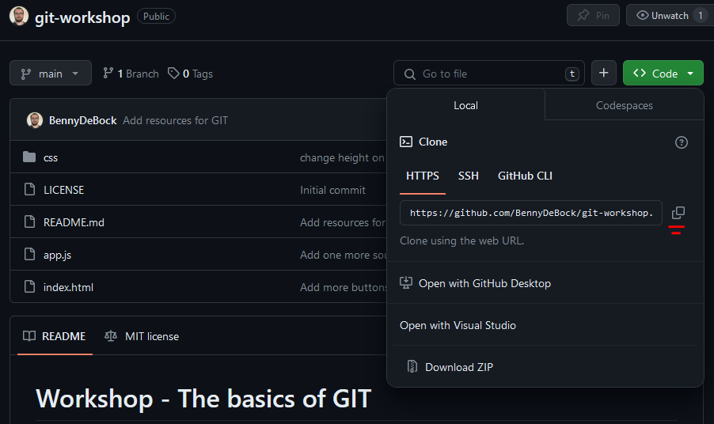
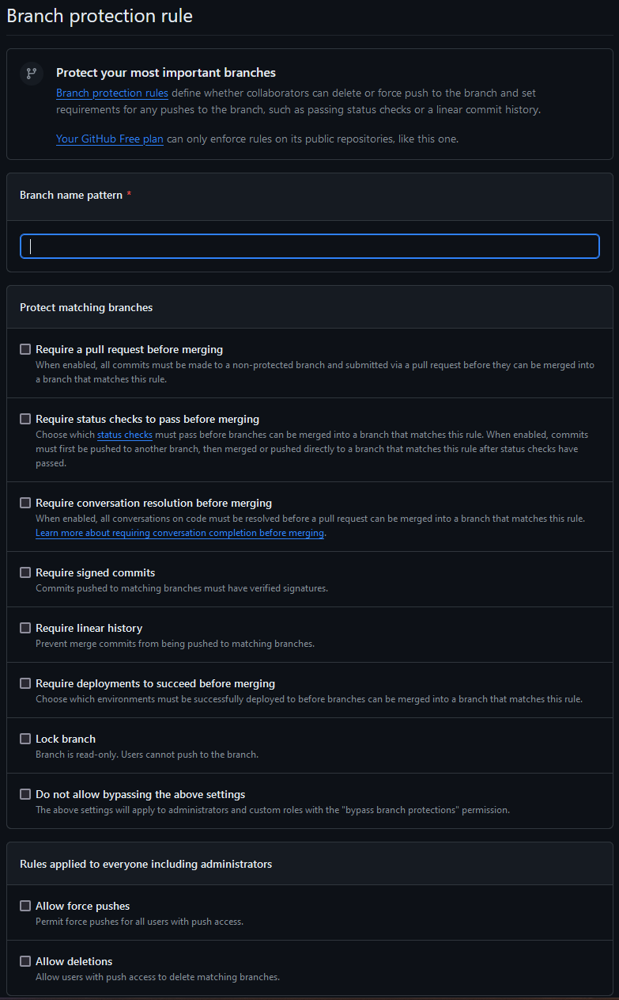
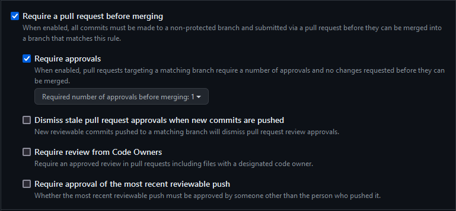

# Workshop - The basics of GIT

## Prerequisites

### GIT

#### Install

To start with this workshop, you should install GIT. You can install Git from here: [https://git-scm.com/downloads](https://git-scm.com/downloads).  
Once you have installed GIT, verify your installation by opening your command prompt/powershell/terminal and type:

```bash
git -v
```

#### Configuration

Before you can use git, you need to configure 2 parameters. We shall do this by running these commands:

```bash
git config --global user.name "John Doe"
git config --global user.email johndoe@example.com
```

> **Note:** replace John Doe and the email with your own name and email (preferably the email that you use for your github account)

### Github

This workshop will use Github, so make you you have a account. If you don't have one, you can create one using the sign up button here: [Github](https://github.com/)

### A Code/text editor

For the purposes of this workshop, we are going to use [VSCode](https://code.visualstudio.com/). If you use this editor, also install the live server extension by Ritwick Dey

## Creating your first commit

### Step 1 - Fork a repository

If you've created your Github account, and you are logged in, press the fork button in the top right corner of [this repository](https://github.com/BennyDeBock/git-workshop).


Make sure the owner is listed as your own account and leave all options as is. Once you've forked the repository, you should be able to find it under your repositories. Open that repository in Github

### Step 2 - Clone your newly created repository

Now that your repository is open, you should see the same files as there were in the repository that you forked from. Now we will clone this repo to our device.

Start by copying the git url. You can find this if you open the green code button, and under HTTPS there should be a link you can copy.


Once you have done that, open your terminal, navigate to whatever folder you'd like the project to be and run the following command:

```bash
git clone https://github.com/<your github name>/git-workshop.git
```

This will clone your repo from github to your local machine in a folder with the same name as the repository.

### Step 3 - Make your first commit

- [x] Clone the repository
- [x] Change the H1 tag to something of your choosing
- [x] Stage the change
- [x] Commit the change
- [ ] Create a file with the name `hobbies.md` and the content of hobbies.txt in the file
- [ ] Stage the change
- [ ] Commit the change
- [ ] Push the changes to Github

> **Note:** If at any point you are unsure of the files you have staged for a commit, you can use `git status`. This command tells you on which branch you are, as well as which files have been modified/staged, how many commits have been done, etc...

#### Extra challenges

- [ ] Add more sources to the `changePlaceholder` function in `app.js`
- [ ] Add deletion of the placeholder element when the `Delete placeholder` button is clicked

## Branches

Branches are an integral part to working with git. Not only do they allowed you to experiment with features, but in some cases, workflows can be set to do specific actions when something happens with said branch.

### Step 4 - Create and switch to branch

- [ ] Create a branch called `development`
- [ ] Switch to the `development` branch

> You can verify whether this succeeded when you use `git status` in the terminal.

- [ ] Make a small change to the `hobbies.md` file
- [ ] Commit the change
- [ ] Push to Github

> You will get a fatal error saying `fatal: The current branch development has no upstream branch`. This is normal when the branch you have created does not exist on Github. To fix this, run `git push --set-upstream origin <name of branch>`. You only need to run this the first time you are pushing to the new branch.

> **Note:** Not every branch needs to be in Github, if you're experimenting, then feel free to not push to Github

### Step 5 - Merging branches

- [ ] Make sure you are on the `development` branch
- [ ] Create a branch called `hotfix-hobbies`
- [ ] Make a change to the `hobbies.md` file and commit
- [ ] Go back to the `development branch`
- [ ] Use the merge command to merge `hotfix-hobbies` into development

#### Updating branches

Sometimes a branch that we are working on is behind the branch that it originally derived from. In this case, we can merge those changes into our local branch.

- [ ] On the `development` branch, make a change in the `hobbies.md` file and commit this
- [ ] Change to the `hotfix-hobbies` branch
- [ ] Merge `development` into `hotfix-hobbies`

#### Resolving merge conflicts

Merging can be a very powerful tool and GIT does a lot of things for us. However, sometimes Git cannot figure out how to merge certain changes. This is called a merge conflict and these can be a bit troublesome to figure out how to fix. These issues tend to be more common when you are working as a team.

Having a good branching strategy can alleviate a lot of these problems to begin with. However, now we will intentionally cause a merge conflict, and look at how to fix this.

- [ ] On the `development` branch, change the first line of the `hobbies.md` file to the following and commit this:

```md
# A title
```

- [ ] On the `hotfix-hobbies` branch, change the first line of the `hobbies.md` file to the following and commit this:

```md
# My Hobbies
```

- [ ] Change back to the `development` branch and merge the `hotfix-hobbies` branch into it.

### Good to know - Branch protection

Branch protection is a tool to set conditions on when you are able to merge. These rules are not native to git and are only common to Git hosting platforms (think Github, Bitbucket, Gitlab).

On Github, you can find these under the Settings of your repository and then going to branches

As you can see, there are a lot of options. The most important things in the Branch name pattern. This should contain the name of the branch that you want to protect.


The most popular option (and one you should probably implement for your projects) is `Require a pull request before merging`.
This way, you can only merge through the Github Desktop app or through Github itself.  
That brings the advantage that people can't make your `main` branch unstable without it having been reviewed by someone else



## Resources

[Oh shit, GIT!?!](https://ohshitgit.com/)  
[GIT.WTF!?!](https://git.wtf/)  
[Git Book by Scott Chacon](https://git-scm.com/book/en/v2)
